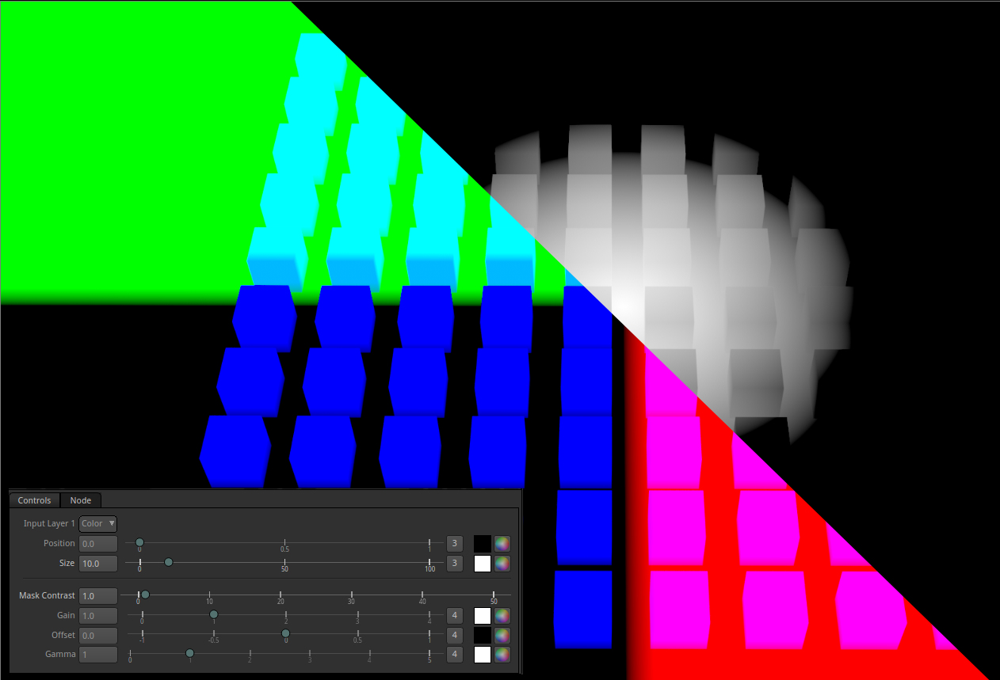

# PositionMask

Take a world position pass and generate a rounded mask from it.

To use it, just pick a color from the position pass were you want the mask to append, then play with the Size slider.

After that you can tweak the softness of the mask by tweaking the Contrast, Gain, Offset and Gamma Sliders.

To generate a position pass from blender , create a material with a setup like in the screenshot below.

Then to apply it to your whole scene you can create a renderlayer and use a Material overhide.

