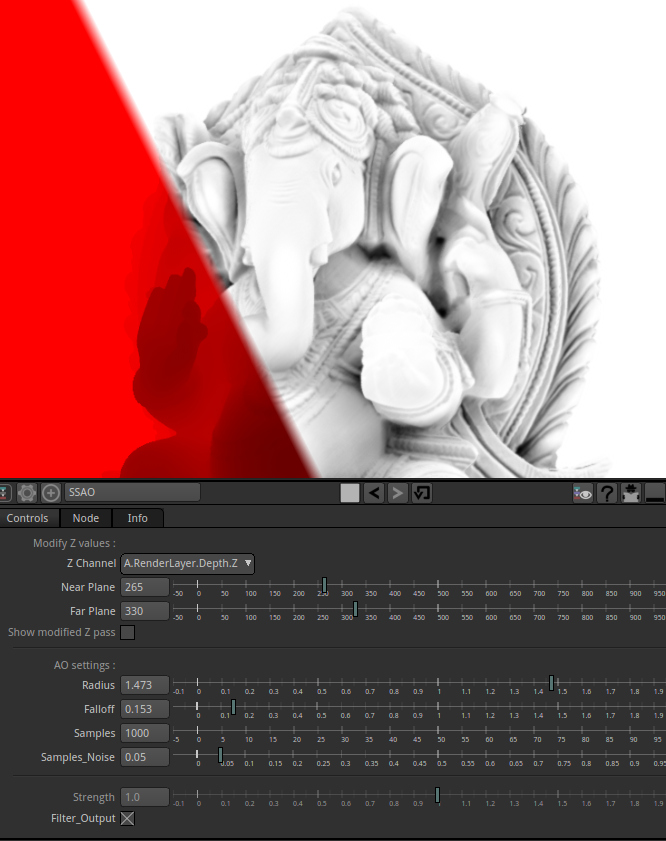

# SSAO

Generate a Screen Space Ambiant Occlusion pass from a Z pass.

May need a bit of time tweaking the parameters to get good results as it changes a lot depending on the original Z values.

More informations below the screenshot 

To use it :
- Set Near and Far plane (minimum and maximum Z Value) to map the Z pass roughly bettween 0 and 1 value.

- Set Radius and Falloff to get good shadows

- Set the sample value (may need up to 1000 iterations for a very smooth result)

- as you increase the samples, you'll need to lower the sample noise value to something like 0.05

- Finally you can blur the AO a little bit to get rid of the final noise/artifacts...

If you have high samples and high noise sample value, the result is still noisy.

If you have low samples and low noise Value , the result as artifacts.

Credits :

The original code by Daniel Holden is taken from here :
http://theorangeduck.com/page/pure-depth-ssao

the sampling sphere fonction by John Chapman is taken from here : 
http://john-chapman-graphics.blogspot.fr/2013/01/ssao-tutorial.html

Shadertoy/Pyplug conversion by Sozap

