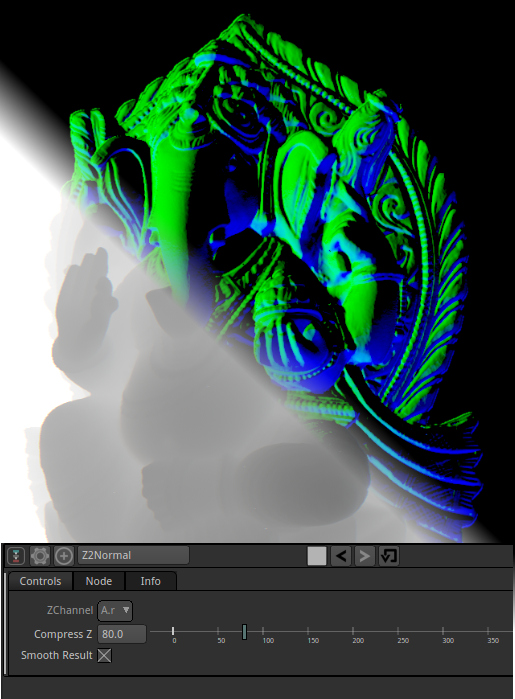

# Z to Normal (Z2Normal)

Generate a Normal pass from a Z pass or any grayscale image where black mean near and white far distance.

Then by using the ReShade Pyplug you can do some relighting effects.

You may increase the Compress Z value to flatten the Z pass (mainly with 3D render) and get a better lighting.

Good value is around the maximal Z value of your object divided by two.

Credits :

The original code by Daniel Holden is taken from here :
http://theorangeduck.com/page/pure-depth-ssao

