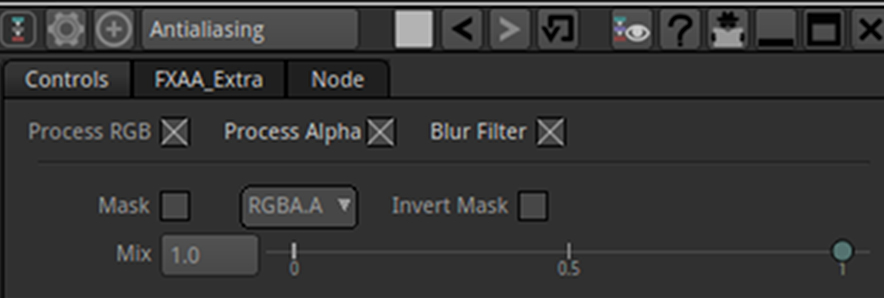
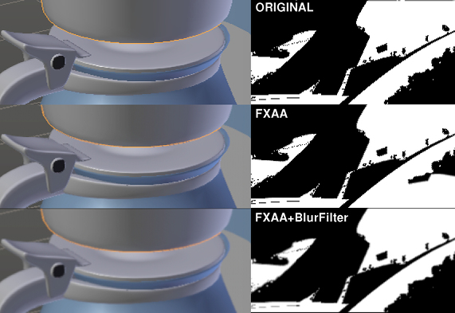
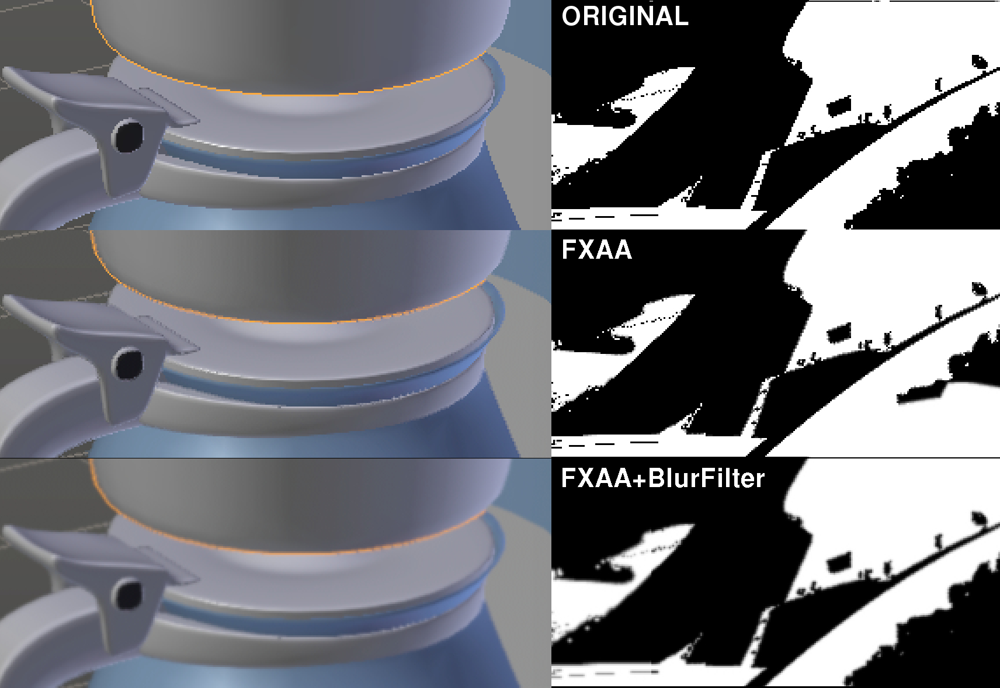

# AntiAliasing

Smooth the edges of pixaleted images by applying an Fast Approximate Anti-Aliasing filtering.
Alternatively this Pyplug can also apply another way of filtering by scaling ,bluring and downscaling the image.
Booth methods can be combined , but the second one is much slower.

This Pyplug can be used for instance to smooth 3D passes that are aliased by default , like Zbuffer(Myst) or IDMask.

FXAA implementation is based on this code :
https://github.com/mattdesl/glsl-fxaa

The MIT License (MIT) Copyright (c) 2014 Matt DesLauriers 

