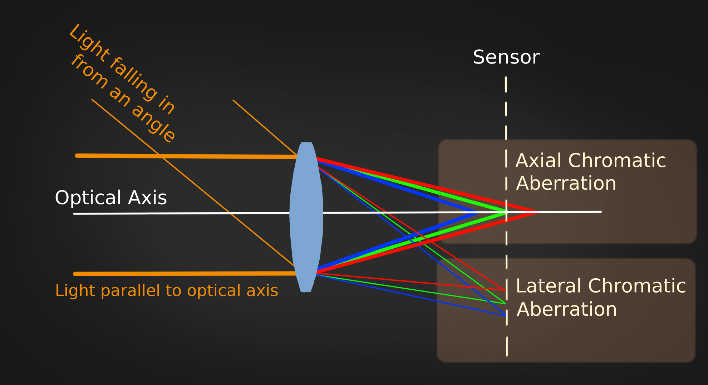

# Chromatic Aberration PP

This PyPlug mimics the optical effect called "chromatic aberration".

It occurs because lenses have different refractive indices for different wave lengths of light (also known as: dispersion) resulting in different convergence points for each wave length.
Normally this is an unwanted effect which the producers of lens systems try to minimize as much as possible. But if used subtly, it can help cg elements to look a bit more naturally and of course it can be used as a nice effect for motion graphics.

Actually there are two types of chromatic aberration:

1. **Axial Chromatic Aberration**

   The axial chromatic abberation occurs because parallel incoming light of different wavelengths is focused on different planes. (As long as the lenses are not corrected) So the green image may be sharp, because it's focus is perfectly aligned with the photosensor, but the blue and the red image might be a bit blurred, because their focus can be slightly off.
   This kind of chromatic aberration is present all over the image. It's noticable especially at the high contrast areas.

2. **Lateral Chromatic Aberration**

   The lateral chromatic aberration will only occure at the periphery of the image. If light falls in from an angle the dispersion causes the light of different wave lengths to focus at different points on the sensor/film. This results in slightly shifted color channels at the periphery, if the lens is not corrected. 

