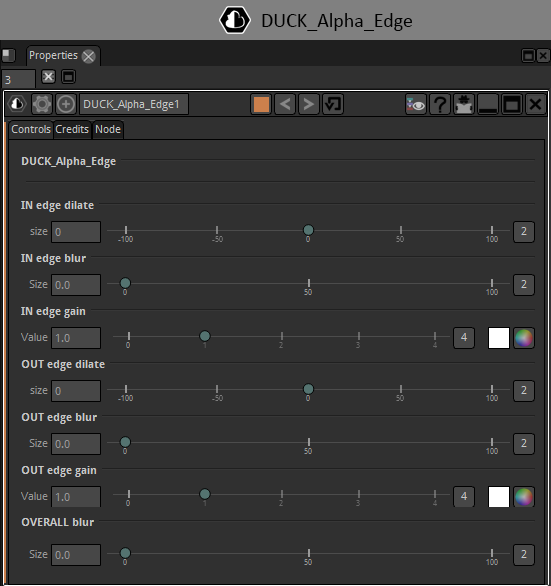

# DUCK_Alpha_Edge

It gives edge of a roto or a key, you have the possibility to dilate or erode,

blur or multiply the edge differently inside and outside.

Simply the best alpha edge you can find for free.

