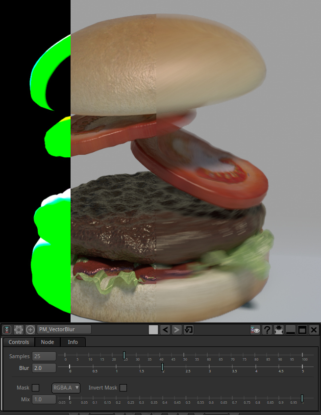

# PM_VectorBlur

Poor Man's Vector Blur...

Blur an image according to a Vector/Motion Pass using the GPU. 

It works, but it's very basic so things like good occlusions or way to prevent bleeding is not supported.

##Tips :
One main issue is that you can have sharp edges with fast moving objects in front of a static background. One easy fix is to apply 
a bur filter on the vector pass or even better, and edge blur with the alpha of the moving object as a matte.

##Credits :
Based on a John Chapman tutorial , thanks to Alessandro Dalla Fontana for the ShaderToy conversion

You can find more info on the original shader page :

http://john-chapman-graphics.blogspot.fr/2013/01/per-object-motion-blur.html

