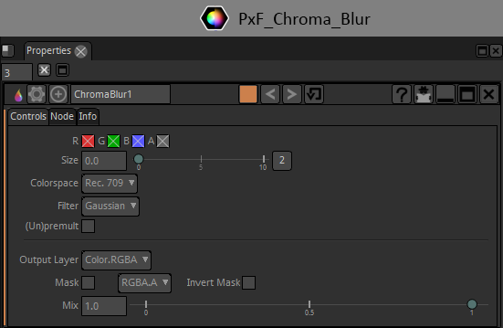

# ChromaBlur

Blur chrominance without affecting luminance. Useful to repair some chroma artifacts in digital video.

### INPUTS
1 = connect the image you want to apply the blur onto.

mask = the mask you want to apply the blur through.

### HOW TO USE IT
Size : the size of your blur.

Y : Luminance.

Cb : Chrominance minus the blue.

Cr : Chrominance minus the red.

