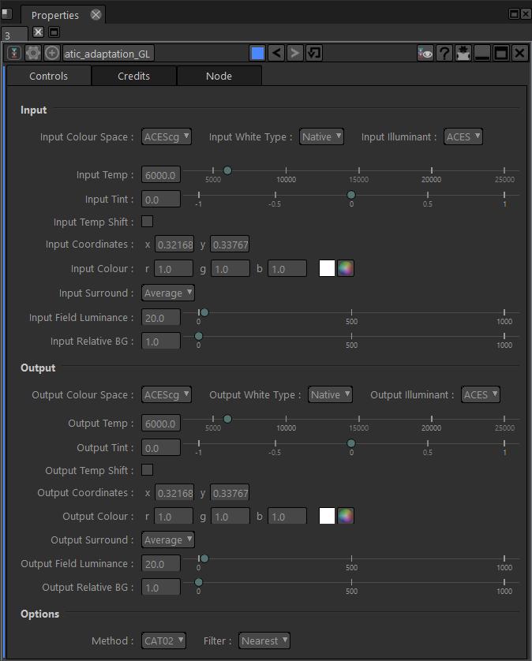

# Chromatic_adaptation_GL

This shader performs a chromatic adaptation. It also takes care of any necessary color space conversions.

### INPUTS
* source = connect the image you want to apply the effect onto.

### HOW TO USE IT

#### Input

* Input Colour Space : Input colour space. Note that the input must be linear in all cases.
  - ACEScg
  - ACES2065-1
  - Rec. 709
  - Rec. 2020
  - P3D65
  - XYZ
* Input White Type : Input white point type.
  - Native
  - Illuminant
  - Colour Temperature
  - XY Coordinates
  - from Colour
* Input Illuminant : Input white point illuminant.
  - ACES
  - HD D65
  - DCI
  - Equal Energy

------------------------------------------------------------------------------------------------------------

* Input Temp : Correlated colour temperature of the input white point (per Illuminant series D).
* Input Tint : Correlated colour tint of the input white point.

* Input Temp Shift : Applies a scaling of the colour temperature by a factor of 1.4388/1.438 to mimic the CIE D-series behavior instead of maintaining the physical exact correlated colour temperature.
* Input Coordinates : CIE 1931 xy coordinates of the input white point.
* Input Colour : Colour representation of the input white point.

* Input Surround : Viewing conditions.
* Input Field Luminance : Input field luminance.
* Input Relative BG : Relative input background brightness compared to the scene white.

------------------------------------------------------------------------------------------------------------

#### Output

* Output Colour Space : Output colour space. Note that the output must be linear in all cases.
  - ACEScg
  - ACES2065-1
  - Rec. 709
  - Rec. 2020
  - P3D65
  - XYZ
* Output White Type : Output white point type.
  - Native
  - Illuminant
  - Colour Temperature
  - XY Coordinates
  - from Colour
* Output Illuminant : Output white point illuminant.
  - ACES
  - HD D65
  - DCI
  - Equal Energy

------------------------------------------------------------------------------------------------------------

* Output Temp : Correlated colour temperature of the output white point (per Illuminant series D).
* Output Tint : Correlated colour tint of the output white point.

* Output Temp Shift : Applies a scaling of the colour temperature by a factor of 1.4388/1.438 to mimic the CIE D-series behavior instead of maintaining the physical exact correlated colour temperature.
* Output Coordinates : CIE 1931 xy coordinates of the output white point.
* Output Colour : Colour representation of the output white point.

* Output Surround : Viewing conditions.
* Output Field Luminance : Output field luminance.
* Output Relative BG : Relative output background brightness compared to the scene white.

------------------------------------------------------------------------------------------------------------

#### Options

* Method : Adaptation method.
  - CAT02
  - CAT02 (simple)
  - Bradford
  - Von Kries
* Filter : Texture filter for the input.
  - Nearest
  - Linear
  - Mipmap
  - Anisotropic

------------------------------------------------------------------------------------------------------------

