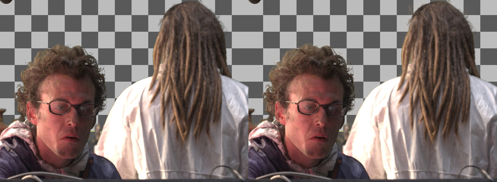

#lp_HairKey

A keyless Keyer for fine detail like hair which is hard to come by with a matte.

Extracts the information with the help of a Cleanplate; a Constant can also be utilized with perfectly even screens.

Has options for bright and dark hair.

Note: needs a newer Snapshot version because the SeExorSimple-Node is used

HairKey in Action (look for the sublte detail, this really shines when moving)
