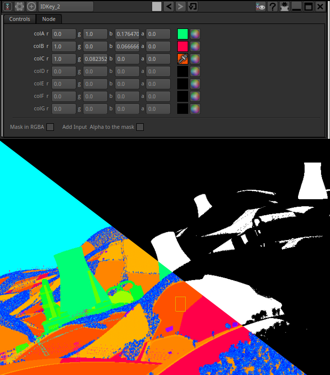

#IDKeyer

Extract an alpha matte from a ID-Pass to be used as a mask

To use :

Select one or more color to be keyed.If the color is not an exact match, or if you use 8bits images for the ID pass, then increase the tolerance factor.

Pure Black color is ignored.

