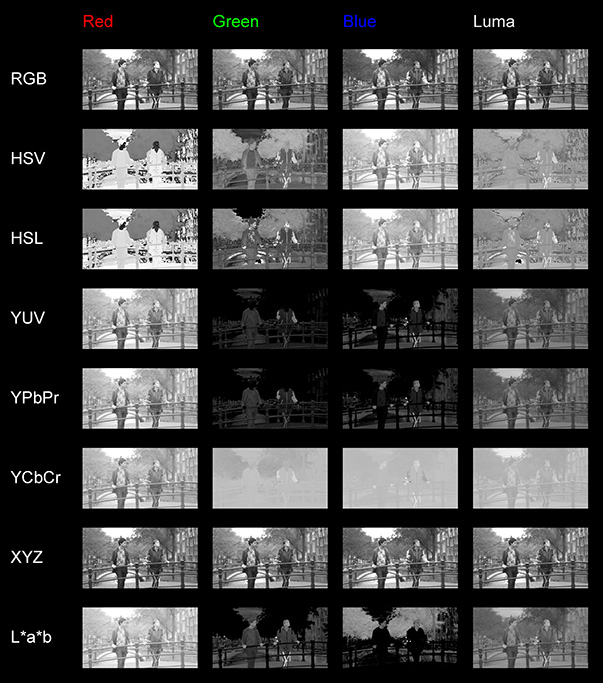

# lp_ChannelContactsheet

Displays an input image in different colourspaces to find a suitable key. Also lets you choose and key from such a channel right away :)

### HOW TO USE IT
Connect an image and look out for a good, high-contrast channel you want to work from. Then, choose the suitable colourspace and channel you want to key from and switch the output from "Contact Sheet" to "Keyer". You can now use black point, white point, range controls etc. to adjust the key as needed. You can also invert the generated matte and premultiply your result right away.

### HOW DOES IT WORK
The input-channel gets reformatted to a smaller version of itself and then split into various different colourspaces, arranged into a grid. For the Keyer-mode, the same happens without the reformatting, with added controls for adjusting the key; the same controls are also found in lp_SimpleKeyer.

This tool is based on Tyler Lockards great Nuke Gizmo: http://www.nukepedia.com/gizmos/keyer/channelcontactsheet

A preview of the generated contactsheet. Footage taken from Tears of Steel, (CC) Blender Foundation | mango.blender.org
