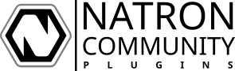

# Natron Community Plugins
### A collection of Natron plugins made by the community
## Installation
### Upgradable Install

The plugins can be installed by simply cloning the github repository at the righht location, for example on Linux:

    cd /usr/share/Natron/Plugins
    git clone https://github.com/NatronGitHub/natron-plugins.git

Later, the plugins can be updated at any time by pulling updates:
  
    cd /usr/share/Natron/Plugins/natron-plugins
    git pull
 
### One-Time Install

To install a snapshot of the repository, download it as a ZIP file via https://github.com/NatronGitHub/natron-plugins/archive/master.zip
 
Unzip into any PyPlug folder but the recommended locations are...
 
    Windows: "C:\Program Files\Common Files\Natron\Plugins"
    
    OSX:     "/Library/Application Support/Natron/Plugins"
    
    Linux:   "/usr/share/Natron/Plugins"
    

Finally edit the plugins location in Natron preferences to allow it to find them during startup, if it's not already.
If you want a particular folder only you can use http://kinolien.github.io/gitzip/ and put the URL to the folder you want there. Also you can install individual .py files (and their accompanied png icon files).

## Available Plugins

### BL/Color
-  **[bl_Bytes](/BL/Color/bl_Bytes/README.md)** : Converts the picture in another byte space. This is of course a simple simulation as Natron works only in 32 floating point color space.

-  **[bl_Compress](/BL/Color/bl_Compress/README.md)** : A common color correction function that pushes the low color to a value and the high color to one another. While tempting to made a color matching between 2 picture this PyPlug might be really usefull.

-  **[bl_Expand](/BL/Color/bl_Expand/README.md)** : Does the exact reverse of the Compress node. It stretches the color between to low and high color values.

-  **[bl_Monochrome](/BL/Color/bl_Monochrome/README.md)** : Same as the Shake's Monochrome node. You can play independently with the 3 color components.

-  **[bl_Slice](/BL/Color/bl_Slice/README.md)** : Cut a color slice of the picture and create a mask of the result.

-  **[bl_Threshold](/BL/Color/bl_Threshold/README.md)** : Thresholds the image using a color value, a range of thresholding and a replacement color.

### BL/Image
-  **[bl_Arc](/BL/Image/bl_Arc/README.md)** : A circle drawer.

### BL/Keyer
-  **[bl_HSVKeyer](/BL/Keyer/bl_HSVKeyer/README.md)** : Creates a mask using the hue saturation and value of the color range.

### BL/Warp
-  **[bl_Bulge](/BL/Warp/bl_Bulge/README.md)** : The Bulge function is a copy of the Bulge inside AfterEffect. This PyPlug is basicaly creating a drop/buble effect on a picture.

### Channel
-  **[ChannelOffset](/Channel/ChannelOffset/README.md)** : Easier to use than the basic TransformMasked node, with additional blur option, and auto-edge extension feature.

-  **[ChannelMerge](/Channel/ChannelMerge/README.md)** : ChannelMerge that mimics Nuke's one.

-  **[Copy_Layer](/Channel/Copy_Layer/README.md)** : Copy RGBA channels from the A input to any layer of the B branch.

-  **[Copy_N](/Channel/Copy_N/README.md)** : Nuke Copy node.

-  **[L_ChannelSolo](/Channel/L_ChannelSolo/README.md)** : Easy to use channel selector.

-  **[Shuffle_N](/Channel/Shuffle_N/README.md)** : Inverted Shuffle node.

-  **[Zmatte](/Channel/Zmatte/README.md)** : Creates a smooth matte from z-depth pass.

### Color
-  **[L_Icolor](/Color/L_Icolor/README.md)** : Tint an image from the A input using another one from the B input.

-  **[lp_Tweaky](/Color/lp_Tweaky/README.md)** : Provides a variety of little tweaking-options, like Vibrance, WB-Slider, Tint, etc.

### Draw
-  **[FrameStamp](/Draw/FrameStamp/README.md)** : A very simple stamp that show the current frame in the corner of the image.

-  **[Gradient](/Draw/Gradient/README.md)** : A 3-4 Way gradient.

-  **[LightWrap_Simple](/Draw/LightWrap_Simple/README.md)** : An alternative to built-in LightWrap plugin, simpler to use, also it as an option to dilate wrap to get a bigger effect.

-  **[Vignette](/Draw/Vignette/README.md)** : This effect reduce the images brightness at the peripherie compared to the image center.

### Filter
-  **[Light Sweep](/Filter/Light%20Sweep/README.md)** : Creates Light Sweep.

-  **[Beauty](/Filter/Beauty/README.md)** : Tool designed to achieve skin cleaning jobs.

-  **[AntiAliasing](/Filter/Antialiasing/README.md)** : Antialiasing filter based on FXAA

-  **[ChromaticAberrationPP](/Filter/ChromaticAberrationPP/README.md)** : A filter designed to match real camera chromatic aberration 

-  **[Chromatic_Aberration](/Filter/Chromatic_Aberration/README.md)** : Create a stylised Chromatic Aberration effect, similar to the one found in Blender.

-  **[DePepper](/Filter/DePepper/README.md)** : Remove Salt and Pepper noise 

-  **[Defocus](/Filter/Defocus/README.md)** : Add a bokeh blur to the image. You can use an image to guide blur size, note that it's not intended to act as a ZBlur plugin.

-  **[FireflyKiller](/Filter/FireflyKiller/README.md)** : Removes fireflies, very bright, nervously jumping around pixels.

-  **[Mosaic](/Filter/Mosaic/README.md)** : A basic mosaic effect.

-  **[Orton](/Filter/Orton/README.md)** : Orton Effect.

-  **[PM_VectorBlur](/Filter/PM_VectorBlur/README.md)** : Poor Man's Vector Blur. Blur an image according to a Vector/Motion Pass, read the doc to know more about limitation

-  **[Refraction](/Filter/Refraction/README.md)** : Glass distorsion using a UV pass.

-  **[SharpenPlus](/Filter/SharpenPlus/README.md)** : Image sharper.

-  **[Volume_Rays](/Filter/Volume_Rays/README.md)** : Enhanced version of Natron's native GodRays, featuring advanced options.

-  **[fxT_Glowy](/Filter/fxT_Glowy/README.md)** : This is an alternative glow effect that mimics the feature of the same gizmo in Nuke.

-  **[L_BlurHue](/Filter/L_BlurHue/README.md)** : A simple hue blur filter.

-  **[lp_ColourSmear](/Filter/lp_ColourSmear/README.md)** : Smears the colors around a given Alpha.

-  **[lp_Despot](/Filter/lp_Despot/README.md)** : Despots for black or white pixels.

-  **[lp_Feather](/Filter/lp_Feather/README.md)** : Feathers your alpha channel

-  **[lp_fakeDefocus](/Filter/lp_fakeDefocus/README.md)** : A very faky Defocus. Very faky. Not very good. Might work for tiny things.

-  **[lp_roughenEdges](/Filter/lp_roughenEdges/README.md)** : Roughens the edges of a given alpha channel based on an adjustable noise.

### Filter/Duck
-  **[DUCK_Alpha_Edge](/Filter/DUCK_Alpha_Edge/README.md)** : It gives edge of a roto or a key, you have the possibility to dilate or erode, blur or multiply the edge differently inside and outside. Simply the best alpha edge you can find for free.

-  **[DUCK_Denoise](/Filter/DUCK_Denoise/README.md)** : It helps to denoise a footage, since it is  not based on analisys: it just provides a denoise for black/white and coloured dots.

-  **[DUCK_Skin_Cleaner](/Filter/DUCK_Skin_Cleaner/README.md)** : A tool developped to clean up models skin in common beauty/fashion shots.

-  **[DUCK_Smart_Blur](/Filter/DUCK_Smart_Blur/README.md)** : Smart Blur isn't a common blur, it helps to blur images with heavy grain, surface imperfections, noises, render problems, etc. keeping the boundary and the edges, and restoring details in highlights and dark regions of the image.

### Filter/Pixelfudger
-  **[PxF_Bandpass](/Filter/PxF_Bandpass/README.md)** : Extract detail from an image. Useful to make plates easier to track.

-  **[PxF_ChromaBlur](/Filter/PxF_ChromaBlur/README.md)** : Blur chrominance without affecting luminance. Useful to repair some chroma artifacts in digital video.

### GLSL/Blur
-  **[Barrel_Blur_Chroma_GL](/GLSL/Blur/BlurBarrel_Blur_Chroma_GL/README.md)** : GPU accelerated Barrel chroma blur effect for Shadertoy.

-  **[Bilateral_GL](/GLSL/Blur/BlurBilateral_GL/README.md)** : GPU accelerated Bilateral blur for Shadertoy.

-  **[Bloom_GL](/GLSL/Blur/BlurBloom_GL/README.md)** : GPU accelerated Bloom effect for Shadertoy.

-  **[BokehCircular_GL](/GLSL/Blur/BokehCircular_GL/README.md)** : GPU accelerated circular defocus blur for Shadertoy.

-  **[BokehDisc_GL](/GLSL/Blur/BlurBokehDisc_GL/README.md)** : GPU accelerated defocus blur for Shadertoy.

-  **[BokehOctagon_GL](/GLSL/Blur/BokehOctagon_GL/README.md)** : GPU accelerated octagon defocus blur for Shadertoy.

-  **[Crok_bloom_GL](/GLSL/Blur/BlurCrok_bloom_GL/README.md)** : Simulates bloom.

-  **[Crok_convolve_GL](/GLSL/Blur/BlurCrok_convolve_GL/README.md)** : Simulates a convolve blur.

-  **[Crok_diffuse_GL](/GLSL/Blur/BlurCrok_diffuse_GL/README.md)** : Creates a noisy blur.

-  **[Crok_dir_blur_GL](/GLSL/Blur/BlurCrok_dir_blur_GL/README.md)** : Creates a directional blur.

-  **[Crok_reskin_GL](/GLSL/Blur/Crok_reskin_GL/README.md)** : Creates skin type textures.

-  **[Ls_Ash_GL](/GLSL/Blur/BlurLs_Ash_GL/README.md)** : Sharpen without ringing edges, or sharpen edges without increasing texture.

-  **[Mipmap_Blur_GL](/GLSL/Blur/BlurMipmap_Blur_GL/README.md)** : GPU accelerated Mipmap blur for Shadertoy.

-  **[Monte_Carlo_Blur_GL](/GLSL/Blur/BlurMonte_Carlo_Blur_GL/README.md)** : GPU accelerated Monte-Carlo blur for Shadertoy.

### GLSL/Channel
-  **[JB_multiMatteManager_GL](/GLSL/Channel/JB_multiMatteManager_GL/README.md)** : Manages up to four inputs RGB to output one combined mulitmatte with alpha.

-  **[K_RgbcmyMatte_GL](/GLSL/Channel/K_RgbcmyMatte_GL/README.md)** : Separates Red, Green, Blue, Cyan, Magenta, Yellow and White from a matte pass.

-  **[Shuffle_AtoRGB_GL](/GLSL/Channel/Shuffle_AtoRGB_GL/README.md)** : Copy the alpha to the RGB.

### GLSL/Color
-  **[AFX_Grade_GL](/GLSL/Color/AFX_Grade_GL/README.md)** : Based off the Nuke grade node.

-  **[Crok_2color_GL](/GLSL/Color/Crok_2color_GL/README.md)** : Simulates a 2 color look.

-  **[Crok_exposure_GL](/GLSL/Color/Crok_exposure_GL/README.md)** : Simulates an exposure node.

-  **[JB_colorRemap_GL](/GLSL/Color/JB_colorRemap_GL/README.md)** : Remaps RGB of input1 using RGB of input 2.

-  **[K_BW_GL](/GLSL/Color/K_BW_GL/README.md)** : Creates black and white images with adjustable RGB values.

-  **[Ls_Colourmatrix_GL](/GLSL/Color/Ls_Colourmatrix_GL/README.md)** : Apply 3x3 matrices to RGB for white balance, colourspace conversion or well disco grades.

-  **[Ls_NaNfix_GL](/GLSL/Color/Ls_NaNfix_GL/README.md)** : Fixes pixels which are stuck at NaN.

-  **[Ls_RndmGrade_GL](/GLSL/Color/Ls_RndmGrade_GL/README.md)** : Generates random grades. Works best on log footage or low-contrast ungraded video.

### GLSL/Distort
-  **[Crok_heathaze_GL](/GLSL/Distort/Crok_heathaze_GL/README.md)** : Creates a heat haze effect.

-  **[Crok_noise_blur_GL](/GLSL/Distort/Crok_noise_blur_GL/README.md)** : Creates a noise texture similar to the popular Genarts Texture.

-  **[Crok_pixelsort_GL](/GLSL/Distort/Crok_pixelsort_GL/README.md)** : Creates a pixel sort type effect.

-  **[Crok_pixelstretch_GL](/GLSL/Distort/Crok_pixelstretch_GL/README.md)** : Creates a Pixelspread type stretch effect.

-  **[JB_pixelDisplace_GL](/GLSL/Distort/JB_pixelDisplace_GL/README.md)** : Image displace effect for Shadertoy.

-  **[JB_timeDisplace_GL](/GLSL/Distort/JB_timeDisplace_GL/README.md)** : Tries to emulate the Sapphire s_TimeDisplace node.

-  **[JT_SyLens_GL](/GLSL/Distort/JT_SyLens_GL/README.md)** : Straightens and distorts footage according to the Syntheyes lens distortion model.

-  **[K_Chroma_GL](/GLSL/Distort/K_Chroma_GL/README.md)** : GPU accelerated chroma abberation effect for Shadertoy.

-  **[Ls_Advect_GL](/GLSL/Distort/Ls_Advect_GL/README.md)** : Pushes an image along the contours of another.

-  **[Ls_nail_GL](/GLSL/Distort/Ls_nail_GL/README.md)** : Warp an area of the Source and Mask to follow a track.

-  **[Ls_Posmatte_GL](/GLSL/Distort/Ls_Posmatte_GL/README.md)** : Pulls a spherical matte from an XYZ position pass.

-  **[Ls_Splineblur_GL](/GLSL/Distort/Ls_Splineblur_GL/README.md)** : Directional blur along the edges of a shape.

-  **[Ls_UVewa_GL](/GLSL/Distort/Ls_UVewa_GL/README.md)** : UV mapping with EWA filtering.

### GLSL/Draw
-  **[Crok_blue_noise_GL](/GLSL/Draw/Crok_blue_noise_GL/README.md)** : Generates a blue noise texture from a still plate.

-  **[Crok_fast_grain_GL](/GLSL/Draw/Crok_fast_grain_GL/README.md)** : Simulates a film like grain.

-  **[Crok_regrain_GL](/GLSL/Draw/Crok_regrain_GL/README.md)** : Simulates film grain.

-  **[Guides_GL](/GLSL/Draw/Guides_GL/README.md)** : Draws simple adjustable horizontal and vertical guides for centering reference, measuring, etc...

### GLSL/Effect
-  **[Anaglyphic_GL](/GLSL/Effect/Anaglyphic_GL/README.md)** : GPU accelerated Anaglyphic effect for Shadertoy.

-  **[Crok_6567_GL](/GLSL/Effect/Crok_6567_GL/README.md)** : Simulates the color palette of a VIC-2 or better known as on of the famous C64 chips.

-  **[Crok_ascii_art_GL](/GLSL/Effect/Crok_ascii_art_GL/README.md)** : Generates ascii art.

-  **[Crok_beer_GL](/GLSL/Effect/Crok_beer_GL/README.md)** : Creates a beer like structure.

-  **[Crok_bleachbypass_GL](/GLSL/Effect/Crok_bleachbypass_GL/README.md)** : GPU accelerated bleachbypass effect for Shadertoy.

-  **[Crok_cel_shading_GL](/GLSL/Effect/Crok_cel_shading_GL/README.md)** : Simulates cel shading.

-  **[Crok_cmyk_halftone_GL](/GLSL/Effect/Crok_cmyk_halftone_GL/README.md)** : GPU accelerated CMYK halftone effect for Shadertoy.

-  **[Crok_contour_GL](/GLSL/Effect/Contour_GL/README.md)** : Creates a handdrawn style edge detect.

-  **[Crok_crosshatch_GL](/GLSL/Effect/Crok_crosshatch_GL/README.md)** : Simulates a simple pencil sketch.

-  **[Crok_crt_GL](/GLSL/Effect/Crt_GL/README.md)** : Creates a CRT style scan-line effect with additional shadowmasking.

-  **[Crok_deband_GL](/GLSL/Effect/Crok_deband_GL/README.md)** : Reduces banding.

-  **[Crok_digital_glitch_GL](/GLSL/Effect/Crok_digital_glitch_GL/README.md)** : Simulates digital glitches.

-  **[Crok_dithering_GL](/GLSL/Effect/Crok_dithering_GL/README.md)** : Creates a dithering effect.

-  **[Crok_emboss_GL](/GLSL/Effect/Crok_emboss_GL/README.md)** : Simulates an emboss effect.

-  **[Crok_flicker_GL](/GLSL/Effect/Crok_flicker_GL/README.md)** : Creates a flickering effect.

-  **[Crok_hexagon_GL](/GLSL/Effect/Crok_hexagon_GL/README.md)** : Generates hexagon patterns.

-  **[Crok_highpass_GL](/GLSL/Effect/Crok_highpass_GL/README.md)** : GPU accelerated highpass filter for Shadertoy.

-  **[Crok_kuwahara_GL](/GLSL/Effect/Crok_kuwahara_GL/README.md)** : Simulates anisotropic kuwahara filtering.

-  **[Crok_lowfi_GL](/GLSL/Effect/Crok_lowfi_GL/README.md)** : Simulates NES, EGA and Gameboy video out.

-  **[Crok_nightvision_GL](/GLSL/Effect/Croknight_vision_GL/README.md)** : Creates a nightvision effect.

-  **[Crok_oil_paint_GL](/GLSL/Effect/Crok_oil_paint_GL/README.md)** : Applies a painterly effet to the image.

-  **[Crok_parallax_GL](/GLSL/Effect/Crok_parallax_GL/README.md)** : Simulates a typical Amiga style parallax effect.

-  **[Crok_pixelate_GL](/GLSL/Effect/Crok_pixelate_GL/README.md)** : GPU accelerated mosaic effect for Shadertoy.

-  **[Crok_scanlines_GL](/GLSL/Effect/Crok_scanlines_GL/README.md)** : Simulates CRT phosphor / shadow mask arrangements.

-  **[Crok_separation_GL](/GLSL/Effect/Crok_separation_GL/README.md)** : Creates a low pass and high pass filter sometimes called frequency separation.

-  **[Crok_tv_rgb_dots_GL](/GLSL/Effect/Crok_tv_rgb_dots_GL/README.md)** : Simulates the typical RGB dots of old TVs.

-  **[Crok_vein_GL](/GLSL/Effect/Crok_vein_GL/README.md)** : Generates veins.

-  **[Crok_vhs_GL](/GLSL/Effect/Crok_vhs_GL/README.md)** : Simulates an old VHS player.

-  **[EWA_GL](/GLSL/Effect/EWA_GL/README.md)** : GPU accelerated EWA antialiasing effect for Shadertoy.

-  **[FXAA_GL](/GLSL/Effect/FXAA_GL/README.md)** : GPU accelerated FXAA antialiasing effect for Shadertoy.

-  **[JB_lidar_GL](/GLSL/Effect/JB_lidar_GL/README.md)** : This node tries to emulate a fake point cloud data provided by a lidar.

-  **[Ls_Dollface_GL](/GLSL/Effect/Ls_Dollface_GL/README.md)** : Blend similar colours with a bilateral filter whilst preserving edges, to remove grain or wrinkles.

-  **[Ls_FXAA_GL](/GLSL/Effect/Ls_FXAA_GL/README.md)** : Fast cheap antialiasing.

-  **[Ls_wireless_GL](/GLSL/Effect/Ls_wireless_GL/README.md)** : Fast cheap antialiasing.

-  **[Money_Filter_GL](/GLSL/Effect/Money_Filter_GL/README.md)** : GPU accelerated Money filter effect for Shadertoy.

### GLSL/Keying
-  **[AFX_Despill_GL](/GLSL/Keying/AFX_Despill_GL/README.md)** : GPU accelerated After Effects despill for Shadertoy.

-  **[Crok_chromakey_GL](/GLSL/Keying/Crok_chromakey_GL/README.md)** : This shader does a fast chroma key.

-  **[Crok_despill_GL](/GLSL/Keying/Crok_despill_GL/README.md)** : Combines multiple LogicOps to streamline your keying node graph.

-  **[Crok_difference_GL](/GLSL/Keying/Crok_difference_GL/README.md)** : Creates a diference matte.

-  **[Crok_edge_matte_GL](/GLSL/Keying/Crok_edge_matte_GL/README.md)** : GPU accelerated edge detect effect for Shadertoy.

-  **[Cryptomatte_GL](/GLSL/Keying/Cryptomatte_GL/README.md)** : Extract up to four mattes from the ID/coverage pairs generated by Arnold/Clarisse/Mantra's Cryptomatte shaders.

-  **[JB_autoMatte_GL](/GLSL/Keying/JB_autoMatte_GL/README.md)** : Creates a RGB multimattes of an input which can be useful to mockup quick keys.

-  **[JB_erodematte_GL](/GLSL/Keying/JB_erodematte_GL/README.md)** : Simple erode node.

### GLSL/Merge
-  **[Add_GL](/GLSL/Merge/Add_GL/README.md)** : GPU accelerated additive merge for Shadertoy.

-  **[Crok_uncomp_GL](/GLSL/Merge/Crok_uncomp_GL/README.md)** : Uncompose a compositing scene into its original layer.

-  **[Ls_Contacts_GL](/GLSL/Merge/Ls_Contacts_GL/README.md)** : Tile inputs into a grid for impressing clients, choosing versions or checking continuity.

-  **[Merge_GL](/GLSL/Merge/Merge_GL/README.md)** : GPU accelerated merge node for Shadertoy.

-  **[Screen_GL](/GLSL/Merge/Screen_GL/README.md)** : GPU accelerated screen merge for Shadertoy.

### GLSL/Source
-  **[Bleepy_Blocks_GL](/GLSL/Source/Bleepy_Blocks_GL/README.md)** : GPU accelerated bleepy blocks generator for Shadertoy.

-  **[Bubbles_GL](/GLSL/Source/Bubbles_GL/README.md)** : GPU accelerated bubbles generator for Shadertoy.

-  **[Cellular_GL](/GLSL/Source/Cellular_GL/README.md)** : GPU accelerated cell generator for Shadertoy.

-  **[cr2_HEX_GL](/GLSL/Source/cr2_HEX_GL/README.md)** : Creates a Hexagon Pattern.

-  **[Crok_3d_grid_GL](/GLSL/Source/Crok_3d_grid_GL/README.md)** : Creates a 3D Grid.

-  **[Crok_blobs_GL](/GLSL/Source/Crok_blobs_GL/README.md)** : Creates blob like sturctures.

-  **[Crok_box_GL](/GLSL/Source/Crok_box_GL/README.md)** : Creates an antialiased square with rounded corners.

-  **[Crok_block_noise_GL](/GLSL/Source/Crok_block_noise_GL/README.md)** : Creates blocky textures.

-  **[Crok_cameraflash_GL](/GLSL/Source/Crok_cameraflash_GL/README.md)** : Creates simple camera flashs.

-  **[Crok_cells_GL](/GLSL/Source/Crok_cells_GL/README.md)** : Creates a cell pattern.

-  **[Crok_cellular_GL](/GLSL/Source/Crok_cellular_GL/README.md)** : Creates tons of cellular like looking patterns.

-  **[Crok_checkerboard_GL](/GLSL/Source/Crok_checkerboard_GL/README.md)** : Creates a checkerboard pattern.

-  **[Crok_fbmPixels_GL](/GLSL/Source/Crok_fbmPixels_GL/README.md)** : Creates a fbm style pattern.

-  **[Crok_flow_GL](/GLSL/Source/Crok_flow_GL/README.md)** : Creates a perlin noise pattern.

-  **[Crok_fractal_GL](/GLSL/Source/Crok_fractal_GL/README.md)** : Creates a fractal pattern.

-  **[Crok_fractal_soup_GL](/GLSL/Source/Crok_fractal_soup_GL/README.md)** : Creates a mandelbrot pattern.

-  **[Crok_gradient_GL](/GLSL/Source/Crok_gradient_GL/README.md)** : Creates a simple gradient effect.

-  **[Crok_lava_GL](/GLSL/Source/Crok_lava_GL/README.md)** : Creates flame / fluid like patterns.

-  **[Crok_lines_GL](/GLSL/Source/Crok_lines_GL/README.md)** : Creates lines.

-  **[Crok_maze_GL](/GLSL/Source/Crok_maze_GL/README.md)** : Creates a maze like structure.

-  **[Crok_ocean_noise_GL](/GLSL/Source/Crok_ocean_noise_GL/README.md)** : Creates an ocean / water like noise pattern.

-  **[Crok_patterns_GL](/GLSL/Source/Crok_patterns_GL/README.md)** : Creates different patterns.

-  **[Crok_perlin_GL](/GLSL/Source/Crok_perlin_GL/README.md)** : Creates a perlin noise like pattern.

-  **[Crok_plasnoid_GL](/GLSL/Source/Crok_plasnoid_GL/README.md)** : Creates tons of different plasma patterns.

-  **[Crok_puffy_noise_GL](/GLSL/Source/Crok_puffy_noise_GL/README.md)** : Simulates puffy noise.

-  **[Crok_snow_GL](/GLSL/Source/Crok_snow_GL/README.md)** : Creates snow.

-  **[Crok_stars_GL](/GLSL/Source/Crok_stars_GL/README.md)** : Simulates stars.

-  **[Crok_tesla_GL](/GLSL/Source/Crok_tesla_GL/README.md)** : Creates tesla lightning bolts.

-  **[Crok_turbulence_GL](/GLSL/Source/Crok_turbulence_GL/README.md)** : Creates a water turbulence texture.

-  **[Crok_voronoi_GL](/GLSL/Source/Crok_voronoi_GL/README.md)** : Creates voronoi noises.

-  **[Crok_wave_lines_GL](/GLSL/Source/Crok_wave_lines_GL/README.md)** : Creates a wave line pattern.

-  **[Crok_wrinkle_lines_GL](/GLSL/Source/Crok_wrinkle_GL/README.md)** : Creates wrinkled paper like sturctures.

-  **[JB_fractal_GL](/GLSL/Source/JB_fractal_GL/README.md)** : Simple fractal generator.

-  **[L_Molten_GL](/GLSL/Source/L_Molten_GL/README.md)** : Molten Metal Texture Gradient shader.

-  **[Magma_GL](/GLSL/Source/Magma_GL/README.md)** : Generates a magma style effect.

-  **[Noise_GL](/GLSL/Source/Noise_GL/README.md)** : GPU accelerated noise generator for Shadertoy.

### GLSL/Transform
-  **[Crok_seamless_GL](/GLSL/Transform/Crok_seamless_GL/README.md)** : Creates seamless textures.

-  **[Crop_GL](/GLSL/Transform/Crop_GL/README.md)** : A simple image cropper with built-in 2D texture offset and borders.

### Keyer
-  **[AdditiveKeyer](/Keyer/AdditiveKeyer/README.md)** : This is not a keyer, It is very good for separating translucent fine details (such as motion blur, dust or hair) that a keyers with mattes might have difficulties extracting.

-  **[BS_AlphaGrainEdge](/Keyer/BS_AlphaGrainEdge/README.md)** : This basic PyPlug simply adds some noise to your alphas around the areas that aren't solid.

-  **[CoveragePass](/Keyer/CoveragePass/README.md)** : Extract Coverage Pass from render in Arnold and Renderman.

-  **[EdgeMatteDetect](/Keyer/EdgeMatteDetect/README.md)** : Description to be written

-  **[IDKeyer](/Keyer/IDKeyer/README.md)** : Extract an alpha matte from a ID-Pass to be used as a mask.

-  **[lp_ChannelContactsheet](/Keyer/lp_ChannelContactsheet/README.md)** : Generate a Contactsheet to find a suitable channel for keying.

-  **[lp_ChillSpill](/Keyer/lp_ChillSpill/README.md)** : An alternative to buit-in Despill node that is quick and easy to setup.

-  **[lp_CleanScreen](/Keyer/lp_CleanScreen/README.md)** : Evens out your Chroma-Screen with the help of a Cleanplate.

-  **[lp_HairKey](/Keyer/lp_HairKey/README.md)** : A keyless Keyer for fine detail like hair which is hard to come by with a matte.

-  **[lp_SimpleKeyer](/Keyer/lp_SimpleKeyer/README.md)** : A very simple Keyer for a wide variety of operations. Inspired by Nukes Keyer-Node.

-  **[OverRange_Alpha](/Keyer/OverRange_Alpha/README.md)** : Generates an alpha channel based on overranged values.

-  **[PositionMask](/Keyer/PositionMask/README.md)** : Take a world position pass and generate a rounded mask from it.

-  **[PushPixel](/Keyer/PushPixel/README.md)** : Pushes pixels of the RGB on the edges of the alpha channel.

### Lens Flare Presets
-  **[Lens Flare Presets](/Lens_Flare_Presets)** : Various Lens Flare presets to use and make new presets.

### Merge
-  **[Linear Wipe](/Merge/Linear%20wipe/README.md)** : Perform Linear wipe.

-  **[Radial Wipe](/Merge/Radial%20Wipe/README.md)** : Perform Radial wipe.

-  **[L_Fuse](/Merge/L_Fuse/README.md)** : Fuse is a replacement for the merge(over) node.

-  **[ZCombine](/Merge/ZCombine/README.md)** : Mix two images according to their Zbuffer.

### mS
-  **[mS_MarkerRemoval_Advanced](/mS/mS_MarkerRemoval_Advanced/README.md)** : This PyPlug lets you easily remove tracking markers from backing screens without the hassle of painting, even when they intersect with the foreground elements.

-  **[mS_RestoreGrain](/mS/mS_RestoreGrain/README.md)** : This PyPlug lets you preserve the original grain from your plate after keying.

### Relight
-  **[Luma_to_Normals](/Relight/Vector_Tools/Luma_to_Normals/README.md)** : Converts any image to normals, using it's Luma Channel. Provides most accurate results used on displacement maps or Zdepth passes.

-  **[ReFlect](/Relight/ReFlect/README.md)** : Take a Normal pass and an image and map it to reflection, similar to matcap in 3D render.

-  **[ReShade](/Relight/ReShade/README.md)** : GPU Relighting of 3D renders using a normal pass.

-  **[SSAO](/Relight/SSAO/README.md)** : Generate an AO pass from a Z pass.

-  **[UV_Map_Generator](/Relight/Vector_Tools/UV_Map_Generator/README.md)** : Generates a default UV map at any resolution. Can be used to run through a lens distortion in another software or any sort of distorion that can then be re-applied with an STMap node.

-  **[UV_to_Vectors](/Relight/Vector_Tools/UV_to_Vectors/README.md)** : Converts a distorted UV map to motion vectors.

-  **[Vectors_Direction](/Relight/Vector_Tools/Vectors_Direction/README.md)** : An utility to rotate 2D vectors such as motion vectors, and flip them if necessary.

-  **[Vectors_Magnitude](/Relight/Vector_Tools/Vectors_Magnitude/README.md)** : An utility to see the magnitude of motion vectors, usually simply as information for the artist.

-  **[Vectors_Normalize](/Relight/Vector_Tools/Vectors_Normalize/README.md)** : Will scale every vector in a vector pass so that each vctor's magnitude is 1, while keeping the direction. Works on 2D and 3D vectors.

-  **[Vectors_to_UV](/Relight/Vector_Tools/Vectors_to_UV/README.md)** : Converts Motion Vectors to an UV map.

-  **[Z2Normal](/Relight/Z2Normal/README.md)** : Generate a Normal Pass from a Z pass

### SB
-  **[sb_AlphaFromMax](/SB/sb_AlphaFromMax/README.md)** : This PyPlug creates an alpha channel based on the max color value of each pixel in any of the RGB channels.

-  **[sb_Erode](/SB/sb_Erode/README.md)** : This PyPlug wraps several erode types into a single gizmo, giving you simple control of which method that works best for your shot.

-  **[sb_LumaKey](/SB/sb_LumaKey/README.md)** : This PyPlug will perform a luminance key of your footage, based on a chosen color space.

-  **[sb_MatteEdge](/SB/sb_MatteEdge/README.md)** : This PyPlug creates an edge matte with control of both the outer and inner radius.

### Time
-  **[TimeLoop](/Time/TimeLoop/README.md)** : generate loops from input image

### Transform
-  **[PM_Camera](/Transform/PM_Camera/README.md)** : Poor's Man 3D Camera, can import .chan data to be used with the PM_Card3D

-  **[Crop_N](/Transform/Crop_N/README.md)** : Crop node similar to Nuke's one

-  **[PM_Card3D](/Transform/3D_Card/README.md)** : Poor's Man Card3D, create a 3D plane, to be used with PM_Camera

-  **[Repeat](/Transform/Repeat/README.md)** : Tiling effect that extends image size.

-  **[Shaker](/Transform/Shaker/README.md)** : Adds a shaking effect to the input image. It's based on an expression similar to wiggle expression in After Effects

-  **[lp_NoiseDistort](/Transform/lp_NoiseDistort/README.md)** : Distorts an image based on two different noise-layer for a more dynamic feel.

### Utility
-  **[Onion_S](/Utility/Onion_S/README.md)** : This is a simple Onion Skin utility node. It supports 5 fames of fixed interval onion skin in the forward and backward directions with user selectable colors, and two blending modes.

-  **[WaveForm](/Utility/WaveForm/README.md)** : Draw a Luminance Waveform of the input image

### Views
-  **[L_AspectMask](/Views/L_AspectMask/README.md)** : Apply standard formats overlay over an image.

## How to Contribute to this repository ?
We'd love to add your own Pyplugs to this repository so everyone can benefit from them.

You can make a Pull Request or if you're not comfortable with git just tell us here :

https://discuss.pixls.us/t/all-about-natron-community-plugins/8433

Also you can look at our guidelines for Pyplug submission :

https://github.com/NatronGitHub/natron-plugins/wiki/Guidelines-for-plugins

