# Shadertoy GLSL presets :

### Replace the original Shadertoy.txt file with the one present in this folder.

## AFX :

- 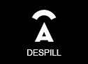 **[AFX_DeSpill]** : Based on the Despill algo if green is greater than the average of the red and blue channels, then bring green down to that color... also works with blue and redscreen, this algo is excellent for maintaining skintones...

-  **[AFX_Grade]** : This is based off the Nuke grade node, so people who are used to the math of this node will be right at home, this node can create negative values, but that's the point, so you will want to clamp if outputing for broadcast...

-  **[AFX_ReverseGrade]** : This node is the reverse grade function found inside the Nuke Grade node. Set your black and white points from your source material (look at front view), then look at the target footage (either via the back or just a context view) and pull the blacks and whites off that plate, then look at result view and tada! they should be a pretty close match...

## CPGP :

- 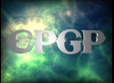 **[CPGP_FractalCell]** : Generates a fractal cell texture

## Crok :

-  **[Crok_2color]** : Simulates a 2 color look.

- 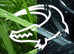 **[Crok_bleachbypas]** : Simulates a bleachbypass process.

- 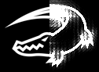 **[Crok_bloom]** : Simulates blooming.

-  **[Crok_bw]** : Creates black and white images with adjustable RGB values.

- 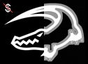 **[Crok_cel_shading]** : Simulates Cel shading.

-  **[Crok_cmyk_halftone]** : Simulates CMYK Halftone patterns.

-  **[Crok_convolve]** : Simulates a Convolve Blur.

-  **[Crok_crosshatch]** : Simulates a simple pencil sketch.

-  **[Crok_deband]** : Reduces banding.

- 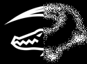 **[Crok_diffuse]** : Creates a noisy blur.

-  **[Crok_dir_blur]** : Creates a directional blur.

-  **[Crok_edge_matte]** : Creates a simple edge matte.

-  **[Crok_exposure]** : Simulates an exposure node, which isn't THAT precise ;) For creative use only !

- 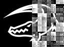 **[Crok_fbm-pixels]** : Creates a fbm style pattern.

- 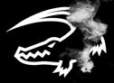 **[Crok_flow]** :  Creates a perlin noise pattern.

-  **[Crok_highpass]** : Simulates a HighPass filter effect.

-  **[Crok_kuwahara]** : Simulates anisotropic kuwahara filtering.

- 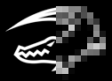 **[Crok_pixelate]** : Pixelates the image.

-  **[Crok_plasnoid]** : Creates tons of different plasma patterns.

-  **[Crok_voronoi]** : Creates voronoi noises.

## JB :

- 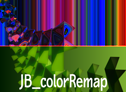 **[JB_colorRemap]** : Remaps RGB of input 1 using RGB of input 2. option to inverse the result as well.

- 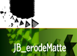 **[JB_erodeMatte]** : Simple erode node.

-  **[JB_fractal]** : Simple fractal generator.

- 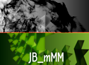 **[JB_multiMatteManager]** : Combines up to four RGB multimatte inputs into one with combined alphas of selected channels.

## K :

- 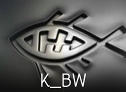 **[K_BW]** : Creates a black and white image based on the dominance of R-G-B channels.

-  **[K_Chroma]** : Warps chroma channels with the ability to add barrel distortion.

-  **[K_RgbcmyMatte]** : Separates Red, Green, Blue, Cyan, Magenta, Yellow and White from a matte pass.

## L :

-  **[L_AlexaLogCv3]** : Linearise the AlexalogCv3 encoded input or go back out as the inverse using the Arri AlexaLogCv3 function for EI800.

-  **[L_CanonLog]** : Linearises the Canon Clog curve.

- 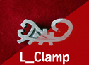 **[L_Clamp]** : Clamp selected pixels to user defined minimum and maximum values.

- 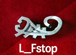 **[L_Fstop]** : Adjust the linear encoded front input exposure in Stops.

- 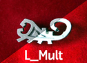 **[L_Mult]** : Multiplies the pixel values in the image.

- 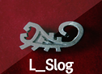 **[L_Sloge]** : Linearise the SLog encoded input using the Sony S-Log function.

## Ls :

- 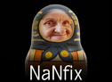 **[Ls_NaNfix]** : Fixes pixels which are stuck at NaN, like those from broken CG renders. The detected pixels are output in the matte for further treatment with PixelSpread.

- 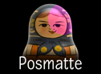 **[Ls_Posmatte]** : Pulls a spherical matte from an XYZ position pass.

- 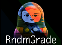 **[Ls_RndmGrade]** : Generates random grades. Works best on log footage or low-contrast ungraded video.

- 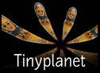 **[Ls_Tinyplanet]** : Stereographic reprojection of 360 panoramas.

- 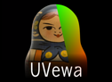 **[Ls_UVewa]** : UV mapping with EWA filtering.

## Other :

-  **[Add_GL]** : Additive merge.

-  **[Divide_GL]** : Divide merge.

-  **[Multiply_GL]** : Multiply merge.

-  **[Screen_GL]** : Screen merge.