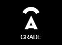
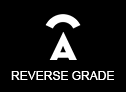
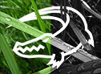
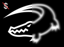
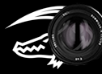
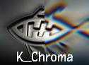
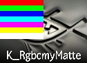

# Shadertoy GLSL presets :

### Replace the original Shadertoy.txt file with the one present in this folder.

## AFX :

-  **[AFX_DeSpill]** : Based on the Despill algo if green is greater than the average of the red and blue channels, then bring green down to that color... also works with blue and redscreen, this algo is excellent for maintaining skintones...

-  **[AFX_Grade]** : This is based off the Nuke grade node, so people who are used to the math of this node will be right at home, this node can create negative values, but that's the point, so you will want to clamp if outputing for broadcast...

-  **[AFX_ReverseGrade]** : This node is the reverse grade function found inside the Nuke Grade node. Set your black and white points from your source material (look at front view), then look at the target footage (either via the back or just a context view) and pull the blacks and whites off that plate, then look at result view and tada! they should be a pretty close match...

## CPGP :

-  **[CPGP_FractalCell]** : Generates a fractal cell texture

## Crok :

-  **[Crok_2color]** : Simulates a 2 color look.

-  **[Crok_bleachbypas]** : Simulates a bleachbypass process.

-  **[Crok_bw]** : Creates black and white images with adjustable RGB values.

-  **[Crok_cel_shading]** : Simulates Cel shading.

-  **[Crok_cmyk_halftone]** : Simulates CMYK Halftone patterns.

-  **[Crok_convolve]** : Simulates a Convolve Blur.

-  **[Crok_dir_blur]** : Creates a directional blur.

-  **[Crok_edge_matte]** : Creates a simple edge matte.

-  **[Crok_exposure]** : Simulates an exposure node, which isn't THAT precise ;) For creative use only !

-  **[Crok_highpass]** : Simulates a HighPass filter effect.

## K :

-  **[K_BW]** : Creates a black and white image based on the dominance of R-G-B channels.

-  **[K_Chroma]** : Warps chroma channels with the ability to add barrel distortion.

-  **[K_RgbcmyMatte]** : Separates Red, Green, Blue, Cyan, Magenta, Yellow and White from a matte pass.

## Other :

-  **[Add_GL]** : Additive merge.

-  **[Divide_GL]** : Divide merge.

-  **[Multiply_GL]** : Multiply merge.

-  **[Screen_GL]** : Screen merge.