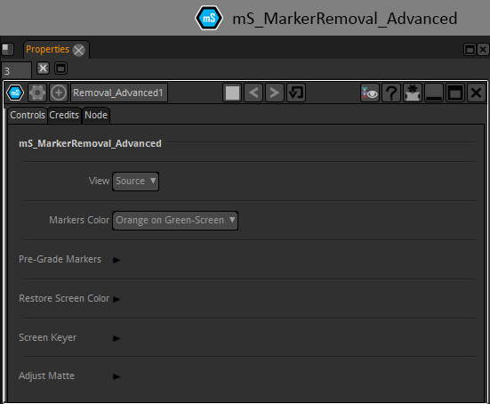

# mS_MarkerRemoval_Advanced

Lets you easily remove tracking markers from backing screens without the hassle of painting, even when they intersect with the foreground elements.

### INPUTS
Plate = your plate.

Markers_Matte = The mask that isolated the markers of the plate..

